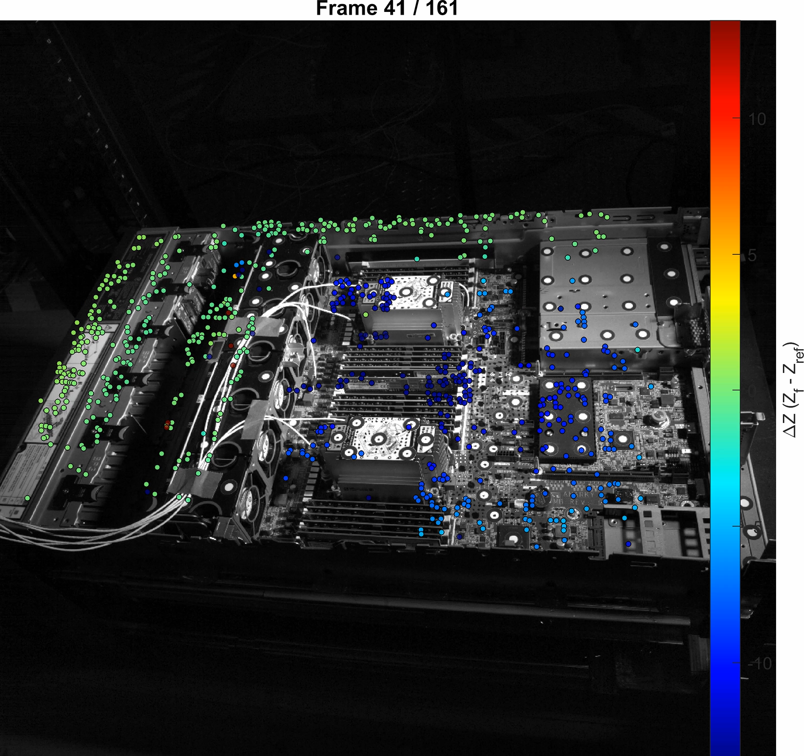
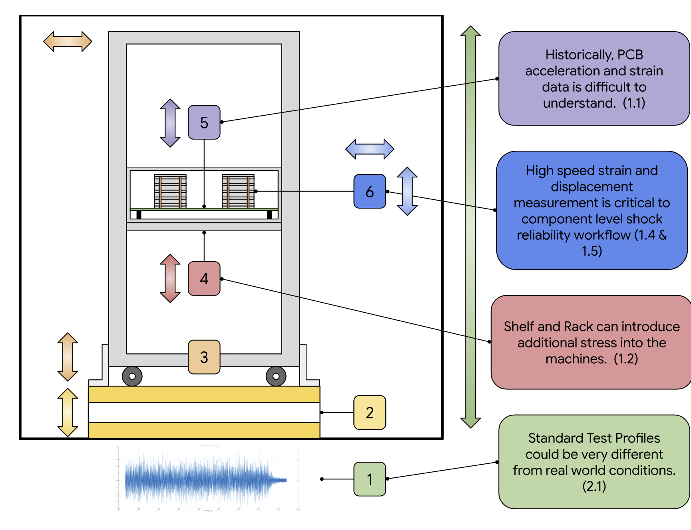
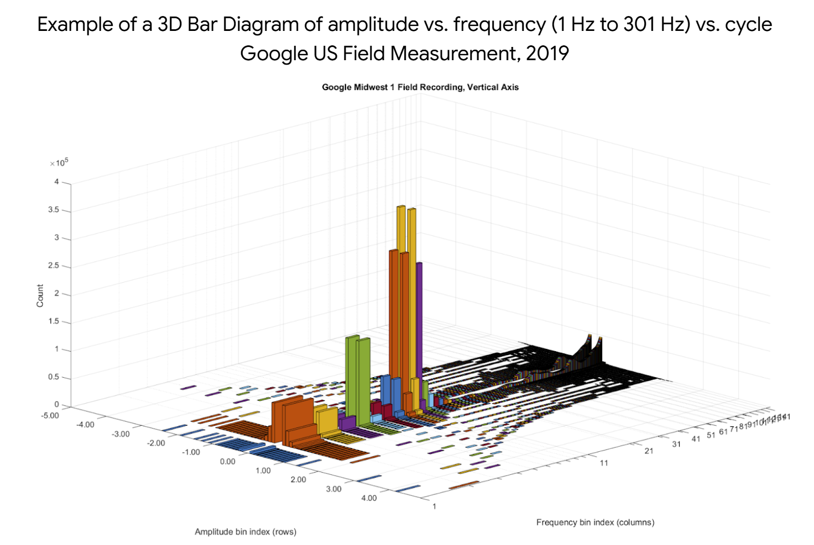
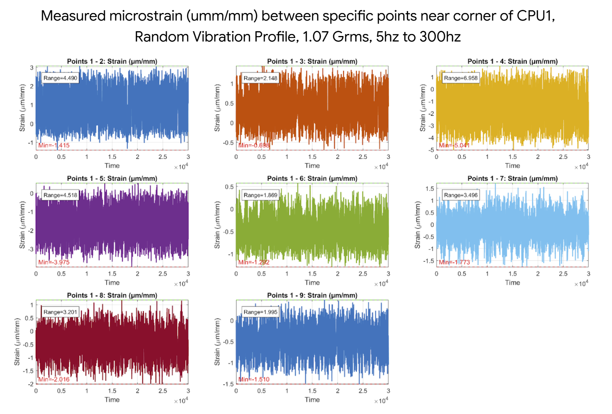

# Open Random Vibration Testing of Off The Shelf DC Hardware

*An open initiative to document, share, and advance mechanical testing of off-the-shelf data‑center hardware and the state of the art of random vibration testing.*

---

## Table of Contents

1. [Project Overview](#project-overview)
2. [White Papers & Detailed Table of Contents](#white-papers--detailed-table-of-contents)
3. [Features](#features)
4. [License](#license)
5. [Contact Information](#contact-information)

---

## *NEWS*

<!-- Machine-level mode shape -->

  

We've published our latest white paper 3.1, titled "3D DISPLACEMENT DATA OF A MACHINE DURING RACK LEVEL VIBRATION TESTING". In it is everything we know about applying computer vision to random vibration testing of fully populated racks, and how this field can leverage the AI revolution sweeping every corner of our world.

We've used it to analyze a record breaking 62,000 frames of HD high speed camera footage captured during random vibration testing of a populated rack (https://lnkd.in/gBqxDvJX), to understand the difference between industry standard and real-world vibration conditions. We've used it to analyze the 3D deformation of a workstation when subjected to free fall shock impact inside a rack (https://lnkd.in/gMDSvheJ).

Starting 2026, we will focus our effort in sharing real world test data with actual off-the-shelf data center hardware.  We will look at machines, components, power, liquid cooling, interconnects, chips, memory, storage, and what everyone is paying attention to - integrated AI system!

So stay tuned, and look out for new papers under the White Papers Section!

## Project Overview

Random vibration occurs throughout a data‑center hardware lifecycle — during rack assembly/integration, air/road/sea transport, warehouse handling, rack installation, and ongoing operation. **Open Random Vibration Testing of OTS DC Hardware** provides freely available methods, results, datasets, and analysis notes so that anyone can reproduce, validate, or implement state of the art random vibration testing of servers, racks, power units, and associated subsystems.

## Content Preview

<!-- Rack-level random vibration stack-up -->

  

<!-- Field Vibration Data -->

  

<!-- Rack-level mode shape -->

  

<!-- Strain via computer-vision DIC -->

  

<!-- Traditional strain-gauge measurement -->

  

  <video src="https://raw.githubusercontent.com/GoogleCloudPlatform/open-random-vibration-testing-of-ots-dc-hardware/main/assets/3D-PointCloud-Surface/Sample_3D_PC_30Hz.mp4"
         width="500"
         loop
         muted
         playsinline
         controls>
    Your browser does not support the video tag.
  </video>

  <video src="https://raw.githubusercontent.com/GoogleCloudPlatform/open-random-vibration-testing-of-ots-dc-hardware/main/assets/3D-PointCloud-Surface/Sample_3D_PC_30Hz_sideview.mp4"
         width="500"
         loop
         muted
         playsinline
         controls>
    Your browser does not support the video tag.
  </video>

  <video src="https://raw.githubusercontent.com/GoogleCloudPlatform/open-random-vibration-testing-of-ots-dc-hardware/main/assets/3D-PointCloud-Surface/Sample_Unit_30Hz_Sine.mp4"
         width="500"
         loop
         muted
         playsinline
         controls>
    Your browser does not support the video tag.
  </video>

> **Goals**
>
> - Accelerate improvements in mechanical robustness and sustainable packaging of latest microelectronics and data center hardware.
> - Reduce qualification cost & time by sharing reproducible test procedures and best practices.
> - Improve quality and meaningfulness of test results.
> - Publish real‑world vibration conditions captured from logistics chains.
> - Publish failure modes and stress limits of common data center hardware and components.
> - Foster collaboration among suppliers, OEMs, hyperscale operators, test labs, and academia.

---

## White Papers & Detailed Table of Contents

<strong>Click to expand full roadmap</strong>

### 📜 Master Table of Contents & Schedule
- 📄 [Table of Content and Schedule of Future Release (PDF)](White%20Papers/Table%20of%20Content%20and%20Schedule%20of%20Future%20Release.pdf)

### Track 1 – Fundamentals of Rack Vibration
- [1.0 High‑Level Overview of Populated Rack Vibration](White%20Papers/Track%201/1.0%20-%20High%20Level%20Overview%20of%20Populated%20Rack%20Vibration.pdf)
- [1.1 Sine Vibration of a Machine](White%20Papers/Track%201/1.1%20-%20Sine%20Vibration%20of%20a%20Machine.pdf)
- [1.2 Sine Vibration of a Rack](White%20Papers/Track%201/1.2%20-%20Sine%20Vibration%20of%20a%20Rack.pdf)
- [1.3 Impact of Random Vibration](White%20Papers/Track%201/1.3%20-%20Impact%20of%20Random%20Vibration.pdf)
- [1.4 Component‑Level Analysis](White%20Papers/Track%201/1.4%20-%20Component%20Level%20Analysis.pdf)
- [1.5 Additional Measurement Methods for Shock and Vibration](White%20Papers/Track%201/1.5%20-%20Additional%20Measurement%20Methods/1.5%20ADDITIONAL%20MEASUREMENT%20METHODS%20FOR%20SHOCK%20AND%20VIBRATION.pdf)

### Track 2 – Field Data & Spectral Characterization
- [2.1 Examination of Random Vibration Data](White%20Papers/Track%202/2.1/2.1%20Examination%20of%20Random%20Vibration%20Data.pdf)
- [2.2 Extracting More Info from Field Data](White%20Papers/Track%202/2.2/2.2%20Extracting%20More%20Info%20from%20field%20data.pdf)

### Track 3 – Real World Case Studies!
- **3.1 3D Displacement Data During Rack Level Testing**  
  &nbsp;&nbsp;• [PDF](White%20Papers/Track%203/3.1)  
  &nbsp;&nbsp;• [Data and Plots Folder](White%20Papers/Track%203/3.1/3.1%20-%20Data%20and%20Plots)

> *More tracks will appear here as new papers get released*

---

## Features

- **Comprehensive Documentation** – Comprehensive white papers detailing test setups, profiles (sine sweep, random), and failure criteria; organized in Tracks for fast navigation.
- **Open Data & Visualizations** – Field‑recorded acceleration time histories (CSV) and shaker‑table profiles, plus example plots such as 3‑D histograms.
- **Photographs & Diagrams** – High‑resolution images of instrumentation layouts, fixtures, and measurement points.
- **Living Repository** – Fresh content drops every two weeks; see the schedule PDF above.
- **Community Collaboration** – Use Issues & Discussions to suggest tests, share data, or improve docs.

---

## License

All content (text, figures, data) is released under the **Creative Commons Attribution 4.0 International (CC BY 4.0)** license. You may copy, remix, and redistribute so long as you provide proper attribution. See the [LICENSE](LICENSE) file for full terms.

---

## Contact Information

Have questions, feedback, or contributions? Email **[openrandomvibe@ocproject.net](mailto\:openrandomvibe@ocproject.net)** or open an [issue](https://github.com/GoogleCloudPlatform/open-random-vibration-testing-of-ots-dc-hardware/issues).

